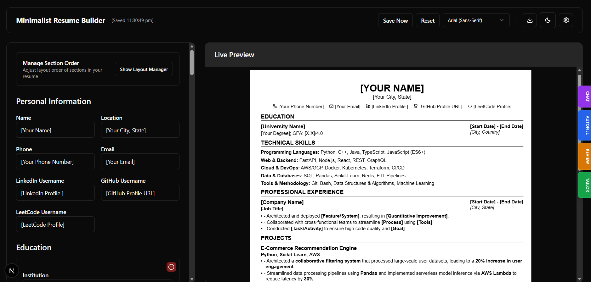
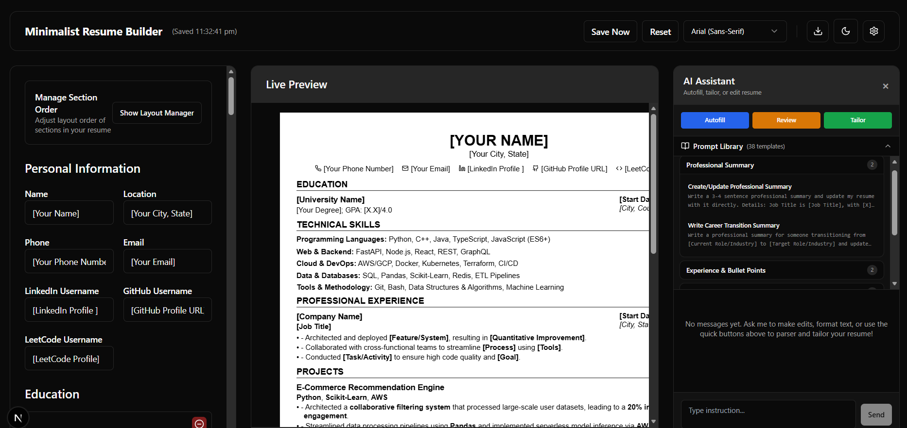
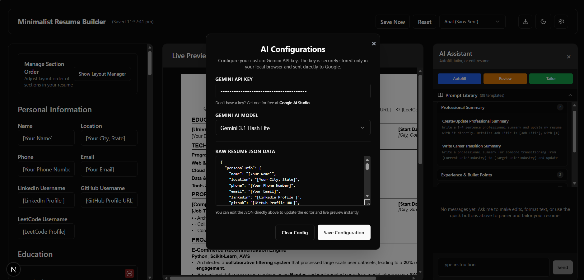

<p align="center">
  
</p>

<p align="center">
  <strong>A premium, interactive AI-powered resume builder designed to create ATS-optimized professional resumes.</strong>
</p>

<p align="center">
  
  
  
  
  
</p>

<p align="center">
  
</p>

---

Minimalist ResumeBuilder combines a structured drag-and-drop form editor with a powerful Gemini AI Assistant sidebar. It allows developers and professionals to build, structure, review, and tailor their resumes to match target job descriptions using natural language commands.

---

## Key Functionalities

### 1. Interactive Form Editor
*   **Structured Section Inputs:** Fill out standard professional fields including Personal Information (LinkedIn, GitHub, LeetCode handles), Education histories, Project portfolios, and Professional Experiences.
*   **Drag-and-Drop Reordering:** Easily modify your resume's layout hierarchy by dragging entire sections to emphasize different areas of your profile.
*   **Custom Dynamic Sections:** Add bespoke sections (e.g., Languages, Certifications, Extracurriculars) with layouts supporting full text, bullet lists, or header-subtitle combinations.

### 2. Gemini AI Assistant
The AI Assistant panel (powered by the latest `gemini-3.1-flash-lite` or `gemini-3.5-flash` models) operates directly on your resume data:
*   **Conversational Editing (Chatbot):** Type instructions (e.g., *"Add a project named Portfolio using Next.js and TypeScript"*, *"Change my phone number"*, or *"Rewrite my latest job description to sound more professional"*). Review and apply proposed changes with a single click.
*   **Resume Parser & Import:** Upload an existing PDF resume or paste raw text. The AI extracts the content and automatically populates the form fields.
*   **Resume Reviewer:** Grades your resume, calculates a quality score, and provides actionable recommendations to improve impact, active verbs, and structure.
*   **AI Job Tailoring:** Paste a target job description; the AI optimizes your experience descriptions, projects, and skills to align with the target keywords for maximum ATS compatibility.

### 3. Print-Perfect Layouts & Typography
*   **A4 Sheet Pagination:** Real-time visual pagination on screen matching standard A4 dimensions. Prevents content overflows, text truncation, or overlap.
*   **One-Page Layout Discipline:** Automatically ensures section spacing is optimized to fit on exactly one page, following the industry standard of a max of 6 main sections.
*   **LaTeX-Style Serif Typography:** Choose from premium sans-serif and serif fonts, including LaTeX-inspired Computer Modern, which persist on refresh and carry over to prints.
*   **Dual Downloads:** Export to clean Microsoft Word (DOCX) files or print directly to pixel-perfect PDFs.

---

## Feature Walkthrough

<table align="center" width="100%">
  <tr>
    <td align="center" width="50%" valign="top">
      <h4>AI Assistant Sidebar</h4>
      
      <br />
      <sub>Conversational chatbot prompt editor, built-in template library, and direct parser/reviewer/tailoring tools.</sub>
    </td>
    <td align="center" width="50%" valign="top">
      <h4>AI Configurations & JSON Editor</h4>
      
      <br />
      <sub>Secure client-side API key configuration, model select options, and direct raw JSON data editor.</sub>
    </td>
  </tr>
</table>

---

## Technical Stack

*   **Frontend Framework:** Next.js (App Router) & React 19
*   **Styling:** Tailwind CSS & Tailwind-Merge
*   **State Management:** React Context and Custom Hooks with local storage persistence
*   **UI Components:** Radix UI Primitives (Shadcn UI blocks)
*   **AI Integration:** Google Generative AI (Gemini Developer API)
*   **Icons:** Lucide React

---

## Getting Started

### Prerequisites

Ensure you have **Node.js** (v18.x or v20.x+) installed.

### 1. Install Dependencies

Install the project dependencies:

```bash
npm install
```

### 2. Run the Development Server

Start the local server using `npx`:

```bash
npx next dev -p 3000
```

The application will run at [http://localhost:3000](http://localhost:3000).

### 3. Build for Production

Generate the optimized production build:

```bash
npx next build
```

### 4. Configure Gemini API Key

Open the application in your browser, click on the **Gear/Settings** icon in the header, and paste your Gemini API Key. The key is stored securely in your browser's local storage and sent directly to Google.

---

## Contributing

Please refer to the separate [CONTRIBUTING.md](./CONTRIBUTING.md) guide for details on our code standards and pull request process.

---

## License

This project is licensed under the MIT License - see the [LICENSE](./LICENSE) file for details.
